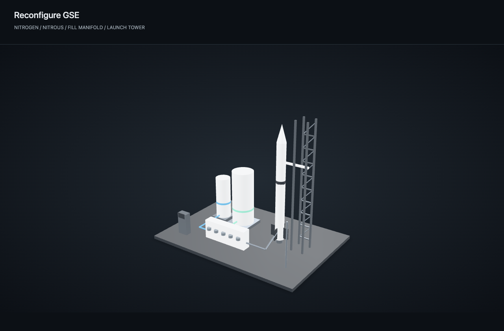

# Ground support equipment sequences

Routine pause, cancel, nitrogen-pass and self-test completion notifications use
`persistent: false`; sequence faults remain persistent until acknowledged.
HTTP/WebSocket notification snapshots restore existing entries, not new events.
Clients should deduplicate by `(id, timestamp_ms)` per backend and avoid replaying
already-seen transient notices on reload, without hiding unresolved faults.

The Actions tab keeps its original controls and contains the new **GSE sequence
actions** in the main button area. Individual valves remain in the **Manual GSE
valves** group. Ground setup (equipment scene, pressure/noise status, settings and
checklist) appears in both Dashboard/state and Mission before launch. It is removed
from Launch onward, leaving the rocket and flight/recovery information.
Do not operate hardware from this software until
qualified personnel have reviewed the plumbing, command mapping, pressure limits,
and failure behavior, and completed an isolated-gas bench test. Software commands
and board acknowledgements are not independent valve-position feedback. Mechanical
pressure regulation, relief protection and a hardware emergency stop are required.

## Configuration

`GET /api/gse/config` reads settings; `POST` or `PUT` saves them (SendCommands
permission required). `GET /api/gse/status` returns the runtime state (ViewData).
Commands use the existing authenticated WebSocket command channel and action policy.
Configuration persists in `backend/config/gse_sequence.json`, overridable with
`GS_GSE_CONFIG`. Runtime calibration and nitrogen-pass status never survive restart.

The only numeric GSE settings in the UI are `nitrogen_target_psi` (nitrogen maximum
pressure) and `pressure_step_psi` (positive increment, default 50 psi). The last
increment is capped at the target. Backend administrators configure
`pressure_ceiling_psi`, `maximum_zero_offset_psi`, and `grouped_panel` in the backend
configuration. The two safety bounds ship unset: automatic operations are unavailable until valid
limits are supplied. Target plus zero allowance must be below the pressure ceiling.
The ceiling is a software trip threshold, not a guarantee against overshoot.
Removing those bounds from the UI does not remove their enforcement.

The **Unlock dry valve self-test** checkbox sits with the main GSE action buttons.
`POST /api/gse/self-test-confirmation` accepts/returns `{"confirmed":true}` or false,
requires command permission and `ValveSelfTest` authorization, and returns 409 during
an active sequence or when trying to unlock after nitrogen testing has started.
Confirmation is not persisted across backend restarts and is consumed by a test.
All existing PT, valve acknowledgement, interlock and sequence gates still apply.
The UI's checkbox must also be checked before its self-test button is enabled.

The ground checklist is a local, per-ground-station operator reminder, retained on
that device when switching views. It has a reset button; reset before each operation.
Checkmarks do not certify hardware state, synchronize across clients, unlock tests,
or bypass backend interlocks.

Calibration opens vent/dump, closes supplies/pilot, waits for acknowledgements, then
collects five seconds of fresh PT samples (at least ten). It records average, min,
max and maximum absolute deviation from the average. Zero is average ± that measured
deviation. Thus 0 ± 3 psi and 5 ± 2 psi are handled without a hardcoded noise floor.
The configured empty-PT allowance bounds the absolute extrema, not just the average;
the latter example requires at least 7 psi. Never enlarge this allowance to teach a
pressurized tank as empty. A PT reading alone cannot establish safe depressurization.

## Actions

| Action | Pilot | Vent | Dump | Nitrogen | Nitrous |
| --- | --- | --- | --- | --- | --- |
| Start fill (configuration first) | Closed | Open | Closed | Closed | Opens only after acknowledgements and zero PT |
| Pause fill | Closed | Closed | Closed | Closed | Closed |
| Cancel fill | Closed | Open | Open | Closed | Closed |
| Nitrogen test | Closed | Closed | Closed | Controlled | Closed |
| Self-test completion / nitrogen dump | Closed | Open | Open | Closed | Closed |

The nitrogen test calibrates zero, closes all valves, and raises pressure in configured
`pressure_step_psi` increments (50 psi by default), with a final smaller step to the
configured target. Each step closes nitrogen,
allows at least two seconds to settle, and holds for five seconds. Rolling averages
filter isolated noisy samples. A drop greater than 3 psi plus the two-reading noise
envelope fails immediately; a sustained five-second mean loss greater than 3 psi
also fails (possibly inconclusive noise), never passes. This is not a certified leak
measurement. Following all holds, dump/vent open; at least a second of samples inside
the calibrated zero band is required before the passed notification and fill unlock.

Self-test requires explicit confirmation that gas supplies are isolated. It opens
one of the five valves, waits for acknowledgement, holds two seconds, then confirms
closure before moving to the next. Ignition and retraction are excluded. Confirmation
is runtime-only and consumed when a test starts. Once nitrogen testing or filling
starts, self-test stays locked for the process session. Restart requires a new
nitrogen test; it does not preserve a previous pass.

Manual valve changes invalidate nitrogen-pass status. Manual valve, launch and
retraction controls are locked while a sequence owns the valves; cancel first.
Missing/stale PT (2 s), invalid PT, pressure ceiling, lost interlock, command transport
errors, missing acknowledgements (5 s), and step/dump timeouts (60 s) stop sequencing.
Faults request supply closure and dump/vent opening while prelaunch. Once the vehicle
leaves prelaunch, only supply closure is requested. Verify physical state after any
fault; a network failure can prevent all requested recovery actions.

## Physical panel

`grouped_panel=true` maps the existing five-button cluster as below; LEDs follow the
mapped action policy. Relabel the panel before enabling this mode. Other buttons
retain their existing meanings. `grouped_panel=false` restores individual valves.

| Existing label / BCM input | Grouped action |
| --- | --- |
| Pilot / 13 | Valve self-test |
| Nitrogen / 23 | Nitrogen test |
| Nitrous / 17 | Start fill |
| Vent / 20 | Pause fill |
| Dump / 12 | Cancel fill |

## Models

The included unbranded GLB scene depicts nitrogen/nitrous tanks, manifold, plumbing,
launch tower and vehicle. Valve colors reflect last acknowledged state, not measured
flow. Animated `nitrogen-test`, `nitrous-fill`, and `dumping` clips indicate sequence
activity only. These illustrative models are not engineering CAD or tank-level data.
Regenerate with `node scripts/build_gse_models.mjs`. The main Dashboard defaults to
a single-stage rocket with aft fins only. Uploaded multi-stage profiles remain
supported through backend configuration and `/media` model administration. Select
Settings → General → Viewing mode → Ground Station view for the instrument/GSE
dashboard. See [model configuration](model-animations.md).

The equipment preview's bundled model-viewer 4.3.1 is Apache-2.0 licensed; see
`backend/assets/model-viewer.LICENSE`. Built-in uncompressed models require no CDN.
The main dashboard instead uses the bundled Three.js named-node renderer (MIT).
Uploaded models using compression may need additional decoder assets.
# HITL button availability

HITL sequence requests are permitted throughout Startup, Idle, PreFill, FillTest,
NitrogenFill, NitrousFill and Armed. Launch and later (and Aborted) disable them.
This flight-state allowance does not bypass engine prerequisites: fresh telemetry,
pressure limits, nitrogen-test completion before fill, and self-test confirmation
remain required. Enabled sequence buttons are illuminated as a readiness indicator;
backend `actuated` still reports actual sequence status, not mere availability.

The backend layout now includes all five GSE sequence action definitions and
adds their command IDs to prelaunch state widgets that contain manual valves.
They therefore appear both in Actions and in the embedded ground-station valve
control panels; manual commands remain available. Layout normalization is
idempotent and applies to regular, HITL, test-fire and custom layouts.
Authorization, action-policy enablement and self-test confirmation are unchanged.

HITL adds illuminated `ToggleGroundStationControl` (**Ground station control**),
default ON on backend restart. It is an authenticated command like Button
Interlock; its state is authoritative in the action policy. It controls automatic
cutoff for the one-button Start Fill, not arbitrary manual valve actions.
Regular/test-fire one-button fills always use automatic cutoff.

The cutoff uses the main fill's signed nitrous mass target and
`GS_SEQUENCE_NITROUS_WEIGHT_RISE_EPSILON_KG` (default 0.03 kg), including its
99.5% threshold. Reaching that target closes immediately; alternatively, the main
pressure minimum and pressure/weight plateau rule stop filling after
`GS_SEQUENCE_NITROUS_LEVEL_SEC` (default 3 seconds). It uses the same shared
plateau calculation as the main sequence. It does not leave a supply open while
waiting for a weight plateau after reaching target.

Automatic cutoff requests Pause Fill (supplies, pilot, dump and vent closed),
then waits for acknowledgements. Fresh calibrated loadcell data (at most 2 seconds
old) is required before starting; losing it during automatic filling faults and
closes supplies. OFF disables only this weight/plateau cutoff; nitrogen-test,
pressure-ceiling, PT freshness and interlock checks remain. OFF requires the
operator to stop fill. Switching ON during filling immediately evaluates the
current weight; switching modes resets accumulated plateau time.

The action panel places sequence actions first and groups Igniter/Igniter Sequence
with manual valve controls. Only Valve Self-test uses the confirmation checkbox.
In HITL, sequence request buttons follow the manual-button interlock; they do not
require a successful nitrogen test, fresh PT, or configured pressure limits merely
to be clickable. This is **not** an execution bypass: the backend engine validates
all normal prerequisites before emitting any valve commands and reports a rejected
start as a notification. Regular and test-fire builds retain sequenced availability.
Missing pressure ceiling/empty-tank offset limits must still be configured by the
backend operator; clicking a button does not supply or override them.
