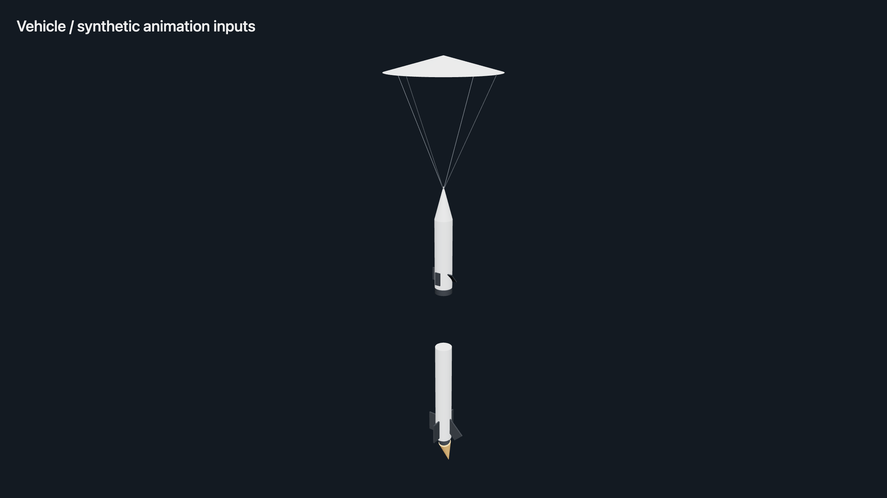

# Telemetry-driven model animation



The Vehicle screen renders the backend GLB using a bundled Three.js named-node
renderer. It can animate actual model parts, not just adjacent status cards.
Open **Vehicle → Model & telemetry animation bindings** with operator permissions
to edit and save the visualization document. The editor accepts built-in vehicle
and GSE scenes as well as uploaded stage-model URLs. Saving a model never sends
hardware commands. Stream-manager status alone does not authorize these edits.

The `motions` array maps normalized telemetry to model transforms:

```json
{
  "node": "fin-pivot-0",
  "transform": "rotate",
  "axis": [0, 0, 1],
  "from": -30,
  "to": 30,
  "binding": {
    "data_type": "YOUR_FIN_TELEMETRY",
    "sender_id": "FC",
    "index": 0,
    "scale": 0.016666667,
    "offset": 0.5
  },
  "phase_values": {}
}
```

This example maps -30…30 degrees to 0…1 and back to the model's -30…30-degree
rotation. Replace the placeholder data type with a real channel from your system.
Values clamp to 0…1 after binding scale/offset. Supported transforms are `rotate`
(degrees about the local axis), `translate` (model units along the axis), `scale`
(axis mask), and `visible` (threshold 0.5). Multiple axes can drive one gimbal.
Changes ease smoothly. Missing nodes show an error; missing or older-than-five-second
telemetry shows unknown instead of continuing to present it as live.

| Built-in nodes | Intended mapping |
| --- | --- |
| `booster-stage`, `sustainer-stage` | Separation translation/rotation |
| `fin-pivot-0` … `fin-pivot-3` | Individual fin angles |
| `gimbal-pivot` | Engine gimbal angle(s) |
| `motor-flame` | Motor active state or throttle scale |
| `airbrake-pivot-0` … `airbrake-pivot-3` | Airbrake angles |
| `drogue-parachute`, `main-parachute` | Recovery deployment/expansion |
| `nitrogen-level`, `nitrous-level` in `gse-site.glb` | Measured fullness (Y scale) |
| `umbilical_boom` (Three.js sanitizes spaces) | Disconnect translation/rotation |

Stock rocket phase visuals show an illustrative ascent flame and expanding recovery
canopies. `phase_values` maps phase names to normalized values; `"*"` is the fallback.
Those are representations of flight phase, not proof of ignition or parachute release.
When a telemetry binding is provided, missing telemetry does not fall back to phase.
Existing `phase_animations` GLB clips and attitude bindings remain supported.

Your hardware does not currently expose every requested fin/gimbal/fullness signal
in the checked-in telemetry schema. The renderer/editor support them, but you must
provide real telemetry and correct model pivots/mappings before treating those visuals
as live measurements. Tank pressure is not automatically converted to tank fullness.
The equipment scene remains illustrative unless level/disconnect channels are mapped.
Uploaded GLBs must have suitable named nodes; do not expect the renderer to infer
mechanical joints from arbitrary meshes. Built-ins are uncompressed and offline-ready;
compressed third-party GLBs may require additional decoder support.

Regenerate built-in assets with `node scripts/build_gse_models.mjs`.
The bundled Three.js 0.180.0 is MIT licensed. Its GLTFLoader/BufferGeometryUtils import
paths are patched to local relative modules; see `backend/assets/three/LICENSE`.
Reference: [Three.js glTF and animation documentation](https://threejs.org/manual/en/animation-system.html).
